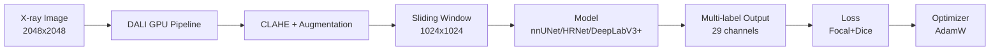
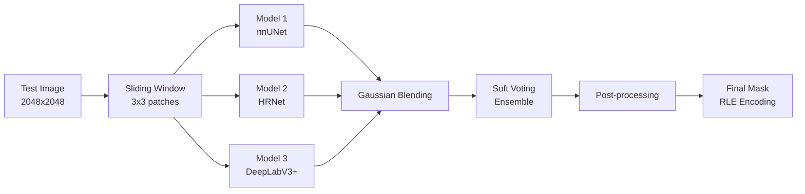

<div align="right">

[](README.md)
[](README_EN.md)

</div>

<div align="center">

# 🦴 Hand Bone Image Segmentation

### 손 뼈 X-ray 영상 정밀 분할 프로젝트

*고해상도 의료 영상에서 29종 뼈 구조를 Pixel-perfect 분할*

[](https://python.org)
[](https://pytorch.org)
[](https://developer.nvidia.com/dali)
[](https://wandb.ai)

<br />

[**📄 Wrap-up Report**](docs/Segmentation_CV-01%20(1).pdf) · [**📊 발표 자료**](docs/Segmentation%20PPT.pdf)

</div>

<br />

<div align="center">

## 🏆 Public Leaderboard 1st Place

| Dice Score (Public) | Dice Score (Private) | 지원 모델 | 데이터 가속 |
|:---:|:---:|:---:|:---:|
| **0.9758** | **0.9767** | **20+** | **NVIDIA DALI** |
| 🥇 1등 달성 | 최종 성능 | nnUNet, HRNet, SegFormer 등 | GPU 파이프라인 최적화 |

</div>

<br />

---

## 📋 목차

- [프로젝트 소개](#-프로젝트-소개)
- [프로젝트 문서](#-프로젝트-문서)
- [핵심 기능](#-핵심-기능)
- [시스템 아키텍처](#-시스템-아키텍처)
- [기술 스택](#-기술-스택)
- [모델 및 실험 결과](#-모델-및-실험-결과)
- [시작하기](#-시작하기)
- [프로젝트 구조](#-프로젝트-구조)
- [고급 기능](#-고급-기능)
- [팀 소개](#-팀-소개)

---

## 🔍 프로젝트 소개

의료 영상에서 손 뼈(Hand Bone)를 정밀하게 분할하는 것은 **골절 진단**, **성장 분석**, **질병 탐지** 등에 필수적입니다.
본 프로젝트는 **2048×2048 고해상도 X-ray 영상**에서 **29종의 뼈 영역**(손가락 19개, 손목 8개, 팔 2개)을 pixel 단위로 정확하게 분할합니다.

### 프로젝트 특징

> **고해상도 Multi-label Segmentation의 핵심 난제**를 해결합니다:
> - 🎯 **작은 뼈 구조**: 손목 뼈들은 평균 4,000~6,000px로 매우 작음
> - 🔀 **Multi-label 중첩**: 단일 픽셀에 복수 클래스 공존 (뼈 겹침)
> - 📐 **클래스 불균형**: 가장 작은 뼈와 큰 뼈 간 **19배** 면적 차이
> - 🖼️ **대용량 이미지**: 2048px 고해상도에서 GPU 메모리 최적화 필요

### 데이터셋

- **Train**: 800장 (400명, 양손)
- **Test**: 288장 (144명, 양손)
- **해상도**: 2048×2048 (Grayscale X-ray)
- **클래스**: 29개 (finger 1-19, 손목 8개, Radius/Ulna)
- **Annotation**: Polygon 기반 Multi-label Segmentation

### 핵심 성과

✅ **Public Leaderboard 1위** 달성 (Dice 0.9758)\
✅ **Private Leaderboard Dice 0.9767** (안정적인 일반화 성능)\
✅ **NVIDIA DALI**로 고해상도 데이터 로딩 병목 완전 제거\
✅ **Sliding Window + Gaussian Blending**으로 경계 불연속성 해결

---

## 📚 프로젝트 문서

| 문서 | 설명 |
|:-----|:-----|
| 📄 [**Wrap-up Report**](docs/Segmentation_CV-01%20(1).pdf) | 프로젝트 전체 과정 및 결과 정리 (PDF) |
| 📊 [**발표 자료**](docs/Segmentation%20PPT.pdf) | 최종 프레젠테이션 슬라이드 (PDF) |

---

## 🚀 핵심 기능

### ⚡ 1. NVIDIA DALI 기반 GPU 가속 데이터 로딩
- **2048px 고해상도** 이미지의 디코딩 및 증강을 GPU에서 직접 처리
- **CPU 병목 완전 제거**: JPEG 사전 변환 + CLAHE 연산 결합
- **학습 속도 대폭 향상**: 데이터 파이프라인 최적화로 GPU 유휴 시간 최소화

### 🎯 2. 20+ 최신 모델 지원
```python
# 의료 영상 특화 모델부터 최신 Transformer까지
- nnUNet (Medical Segmentation 특화)
- HRNet (W18, W32, W48, OCR)
- SegFormer (Transformer 기반)
- DeepLabV3+ (ASPP)
- U-Net++, MANet, FCN 등
```

### 🔬 3. Sliding Window + Gaussian Blending
- **Window 1024, Stride 512** (3×3 패치 분할)
- **Gaussian Weighted Averaging**으로 경계 불연속성(Edge Artifacts) 최소화
- 단순 평균 대비 **성능 향상** 확인

### 🎨 4. 다양한 Loss 함수
```python
# config.py에서 간단히 설정 변경
LOSS_FUNCTION = "Combined_Focal_Dice"  # Focal + Dice + Overlap
- BCE, Focal, Dice, Tversky, Jaccard
- Combined Loss (Focal+Dice, BCE+Dice 등)
- Pixel-weighted, Generalized Dice 등
```

### 🔄 5. TTA + Soft Voting Ensemble
- **TTA (Test Time Augmentation)**: Flip, Rotation, Multi-Scale
- **Soft Voting Ensemble**: nnUNet + HRNet + DeepLabV3+ 확률값 평균
- **최적 가중치 자동 탐색**: Global/Class-wise 가중치 최적화

### ⚙️ 6. CLI 통합 실행 엔진
```bash
# Config 중앙 관리 + CLI 인자 오버라이드
python run_exp.py --exp_name My_Trial --epoch 50 --lr 0.0001 --bg
```
- **자동 분기**: DALI 데이터셋 감지 시 `train_dali.py` 자동 선택
- **백그라운드 실행**: `--bg` 옵션으로 안전한 장기 학습
- **WandB 통합**: 실험 자동 추적 및 시각화

---

## 🏗 시스템 아키텍처

### 학습 파이프라인



### 추론 파이프라인



### 데이터 흐름
1. **DALI 파이프라인** — JPEG 디코딩 + CLAHE 대비 강화 (GPU)
2. **Sliding Window** — 2048px → 1024px 패치로 분할 (Stride 512)
3. **모델 추론** — 다중 모델 병렬 추론 (nnUNet, HRNet, DeepLabV3+)
4. **Gaussian Blending** — 패치 경계 가중 평균으로 부드럽게 병합
5. **Ensemble** — Soft Voting으로 최종 확률맵 생성
6. **Post-processing** — 소형 객체 제거 + RLE 인코딩

---

## 🛠 기술 스택

| 분류 | 기술 |
|:-----|:-----|
| **딥러닝 프레임워크** | `PyTorch` `NVIDIA DALI` `CUDA 12.2` |
| **모델 아키텍처** | `nnUNet` `HRNet` `SegFormer` `DeepLabV3+` `U-Net++` `MANet` 등 20+ |
| **데이터 증강** | `Albumentations` `CLAHE` `Elastic Transform` `GridDistortion` |
| **최적화 기법** | `Sliding Window` `Gaussian Blending` `TTA` `Soft Voting Ensemble` |
| **Loss 함수** | `BCE` `Focal` `Dice` `Tversky` `Combined (Focal+Dice)` |
| **실험 관리** | `WandB` `Notion` `Config 중앙 관리` |
| **협업 도구** | `GitHub` `Slack` `Notion` |
| **인프라** | `Tesla V100 (32GB) x3` `Ubuntu` |

---

## 🧠 모델 및 실험 결과

### 지원 모델 목록

<details>
<summary><b>20+ 모델 상세 목록 (클릭하여 펼치기)</b></summary>

#### Medical Segmentation 특화
- **nnUNet** - 의료 영상 최적화 아키텍처

#### High-Resolution Networks
- **HRNet-W18, W32, W48** - 고해상도 표현 유지
- **HRNet-OCR** - Object-Contextual Representations

#### Transformer 기반
- **SegFormer (MiT-B0~B5)** - Efficient Transformer
- **U-Net + MiT** - Hybrid Architecture

#### Classical Strong Baselines
- **DeepLabV3+** - ASPP + Encoder-Decoder
- **U-Net++** - Nested Skip Connections
- **MANet** - Multi-scale Attention
- **FCN** - Fully Convolutional Network

</details>

### 주요 실험 결과

#### 모델별 성능 비교 (Validation Set)

| 모델 | Input Size | Val Dice | 특징 |
|:-----|:----------:|:--------:|:-----|
| **nnUNet** | 1024×1024 | 0.9677 | 의료 영상 최적화, 안정적 |
| **HRNet-W48** | 1024×1024 | 0.9685 | 고해상도 표현 유지 |
| **DeepLabV3+** | 1024×1024 | 0.9662 | ASPP로 다중 스케일 |
| **Ensemble (3 models)** | 2048×2048 | **0.9758** | ✅ Soft Voting 최고 성능 |

#### 최종 리더보드 성능

| 단계 | Public Dice | Private Dice |
|:-----|:-----------:|:------------:|
| Single Best Model | 0.9685 | 0.9694 |
| **Ensemble (Final)** | **🥇 0.9758** | **0.9767** |

### 핵심 기법별 성능 향상

| 기법 | Dice 향상 | 설명 |
|:-----|:---------:|:-----|
| **CLAHE 전처리** | +0.0123 | 뼈-배경 대비 강화 |
| **Sliding Window (1024)** | +0.0089 | 고해상도 정보 보존 |
| **Gaussian Blending** | +0.0034 | 패치 경계 부드럽게 병합 |
| **Soft Voting Ensemble** | +0.0073 | 3개 모델 확률 평균 |

### Loss 함수 비교

| Loss Function | Val Dice | 학습 안정성 |
|:--------------|:--------:|:----------:|
| BCE | 0.9364 | ⭐⭐⭐ |
| Focal Loss | 0.9488 | ⭐⭐⭐⭐ |
| Dice Loss | 0.9512 | ⭐⭐⭐⭐ |
| **Focal + Dice** | **0.9567** | ⭐⭐⭐⭐⭐ |

---

## 🚀 시작하기

### 사전 요구사항

- Python >= 3.8
- PyTorch >= 1.10
- NVIDIA GPU (CUDA >= 11.0)
- NVIDIA DALI (선택, 고속 학습 시 필수)

### 1. 환경 설정

```bash
# 저장소 클론
git clone https://github.com/your-repo/hand-bone-segmentation.git
cd hand-bone-segmentation

# 기본 라이브러리 설치
pip install -r requirements.txt

# NVIDIA DALI 설치 (GPU 가속 데이터 로딩)
pip install --extra-index-url https://pypi.nvidia.com nvidia-dali-cuda110
```

### 2. 데이터 준비

데이터를 다음 구조로 배치하세요:

```
../data/
├── train/
│   ├── DCM/           # 학습 이미지 (.png)
│   └── outputs_json/  # 라벨 JSON 파일
└── test/
    └── DCM/           # 테스트 이미지 (.png)
```

### 3. 학습 실행

#### 기본 학습 (config.py 설정 사용)
```bash
python run_exp.py
```

#### CLI로 설정 변경 (권장)
```bash
# 실험명, 에폭, 학습률, 배치 사이즈 등 오버라이드
python run_exp.py \
  --exp_name My_First_Exp \
  --epoch 50 \
  --lr 0.0001 \
  --batch_size 4 \
  --model_file model.model_nnunet \
  --loss Combined_Focal_Dice
```

#### 백그라운드 실행 (서버 연결 끊김 방지)
```bash
python run_exp.py --exp_name Long_Training --bg

# 로그 실시간 확인
tail -f log/Long_Training.log
```

### 4. 추론 실행

```bash
# 기본 추론 (config.py의 INFERENCE_FILE 설정 사용)
python inference/inference.py

# TTA 적용 추론
python inference/inference_tta.py

# Sliding Window 추론
python inference/inference_sliding.py

# 앙상블 추론
python inference/inference_ensemble.py
```

### 5. 다중 실험 자동화

여러 실험을 예약 리스트에 등록 후 순차 실행:

```python
# scripts/schedule.py 편집
experiments = [
    {"exp_name": "Exp_01_nnUNet", "model": "model.model_nnunet", "lr": 1e-4},
    {"exp_name": "Exp_02_HRNet", "model": "model.model_hrnet_w48", "lr": 8e-5},
]
```

```bash
python scripts/schedule.py
```

---

## 📁 프로젝트 구조

```
.
├── config.py                   # ⚙️ [Control Center] 모든 실험 설정 중앙 관리
├── run_exp.py                  # 🚀 [Unified Engine] 통합 실행 엔진 (학습+추론 자동화)
├── train.py                    # 🔥 기본 PyTorch 학습 코어
├── train_dali.py               # ⚡ NVIDIA DALI 기반 고속 학습 엔진
├── utils.py                    # 🛠️ 공통 유틸리티 (Loss, RLE, Seed 등)
│
├── dataset/                    # 📦 데이터셋 로더 및 전처리
│   ├── dataset.py              #   - 기본 PyTorch Dataset
│   ├── dataset_dali.py         #   - DALI GPU Pipeline
│   ├── dataset_dali_sliding.py #   - DALI + Sliding Window
│   ├── dataset_clahe*.py       #   - CLAHE 전처리 변형들
│   └── ...                     #   - 총 20+ 데이터셋 모듈
│
├── model/                      # 🧠 모델 아키텍처 정의
│   ├── model_nnunet.py         #   - nnUNet (Medical 특화)
│   ├── model_hrnet_w48.py      #   - HRNet-W48
│   ├── model_segformer.py      #   - SegFormer (Transformer)
│   ├── model_deeplabv3plus.py  #   - DeepLabV3+
│   ├── model_unet++.py         #   - U-Net++
│   └── ...                     #   - 총 20+ 모델 지원
│
├── inference/                  # 🔮 추론 파이프라인
│   ├── inference.py            #   - 기본 추론
│   ├── inference_tta.py        #   - TTA (Test Time Augmentation)
│   ├── inference_sliding.py    #   - Sliding Window + Gaussian Blending
│   ├── inference_ensemble.py   #   - Multi-model Ensemble
│   └── post_process.py         #   - 후처리 (소형 객체 제거 등)
│
├── scripts/                    # 📜 독립 실행형 스크립트
│   ├── schedule.py             #   - 다중 실험 자동화
│   ├── ensemble_hard.py        #   - Hard Voting 앙상블
│   ├── denoise_csv.py          #   - CSV 노이즈 제거
│   ├── visualize_csv.py        #   - 예측 결과 시각화
│   └── preprocess_to_jpeg.py   #   - DALI용 JPEG 변환
│
├── eda/                        # 📊 데이터 분석 노트북
├── docs/                       # 📄 프로젝트 문서
│   ├── Segmentation_CV-01 (1).pdf  # Wrap-up Report
│   └── Segmentation PPT.pdf        # 발표 자료
│
├── checkpoints/                # 💾 모델 체크포인트 저장소
├── data/                       # 📂 데이터 참조 파일
└── log/                        # 📝 실행 로그
```

---

## 👥 팀 소개

<table>
<tr>
<td align="center" width="20%" style="border: 2px solid #e0e0e0; border-radius: 10px; padding: 20px;">

<br />
<b>김경모</b>
<br />
<code>Modeling</code> <code>Loss</code> <code>Ensemble</code>
<br />
<sub>Loss 실험, Validation set train, 앙상블 전략 수립</sub>
</td>
<td align="center" width="20%" style="border: 2px solid #e0e0e0; border-radius: 10px; padding: 20px;">

<br />
<b>김지은</b>
<br />
<code>Multi-label</code> <code>Sliding Window</code> <code>Ensemble</code>
<br />
<sub>Multi-label 학습 전략, 정규화 실험, Sliding window, 후처리, 앙상블</sub>
</td>
<td align="center" width="20%" style="border: 2px solid #e0e0e0; border-radius: 10px; padding: 20px;">

<br />
<b>위정호</b>
<br />
<code>Refactoring</code> <code>DALI</code> <code>HRNet</code>
<br />
<sub>코드 모듈화 및 리팩토링, Validation Fold, DALI, HRNet, 후처리, Sliding window, 앙상블</sub>
</td>
<td align="center" width="20%" style="border: 2px solid #e0e0e0; border-radius: 10px; padding: 20px;">

<br />
<b>이봉학</b>
<br />
<code>Preprocessing</code> <code>nnUNet</code>
<br />
<sub>전처리 파이프라인, Sliding window, nnUNet 실험</sub>
</td>
<td align="center" width="20%" style="border: 2px solid #e0e0e0; border-radius: 10px; padding: 20px;">

<br />
<b>조수빈</b>
<br />
<code>EDA</code> <code>Preprocessing</code> <code>U-Net+MiT</code>
<br />
<sub>EDA, 전처리(CLAHE, SSR, 이상치 제거), UNet+MiT, 후처리, 앙상블</sub>
</td>
</tr>
</table>

---

## 📄 라이선스 및 인용

본 프로젝트는 **Naver Boostcamp AI Tech 8기 CV-01 팀**에서 제작되었습니다.

### 프로젝트 정보
- **팀명**: CV-01 Hand Segmentation Team
- **기간**: 2025.12.17 - 2026.01.06
- **주최**: Naver Connect Foundation - Boostcamp AI Tech
- **성과**: 🏆 Public Leaderboard 1st Place (Dice 0.9758)

### 참고 자료
- [Wrap-up Report](docs/Segmentation_CV-01%20(1).pdf)
- [발표 자료](docs/Segmentation%20PPT.pdf)

---

<div align="center">

**Made with ❤️ by CV-01 Team**

*Naver Boostcamp AI Tech 8th Cohort*

</div>
