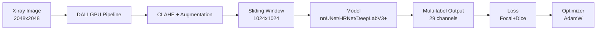
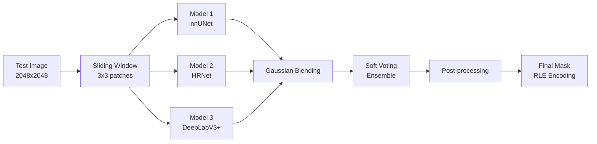

<div align="right">

[](README.md)
[](README_EN.md)

</div>

<div align="center">

# 🦴 Hand Bone Image Segmentation

### Precision Medical Image Segmentation for X-ray Analysis

*Pixel-perfect segmentation of 29 bone structures from high-resolution medical images*

[](https://python.org)
[](https://pytorch.org)
[](https://developer.nvidia.com/dali)
[](https://wandb.ai)

<br />

[**📄 Wrap-up Report**](docs/Segmentation_CV-01%20(1).pdf) · [**📊 Presentation**](docs/Segmentation%20PPT.pdf)

</div>

<br />

<div align="center">

## 🏆 Public Leaderboard 1st Place

| Dice Score (Public) | Dice Score (Private) | Supported Models | Data Acceleration |
|:---:|:---:|:---:|:---:|
| **0.9758** | **0.9767** | **20+** | **NVIDIA DALI** |
| 🥇 1st Place | Final Performance | nnUNet, HRNet, SegFormer, etc. | GPU Pipeline Optimization |

</div>

<br />

---

## 📋 Table of Contents

- [Overview](#-overview)
- [Documentation](#-documentation)
- [Key Features](#-key-features)
- [System Architecture](#-system-architecture)
- [Tech Stack](#-tech-stack)
- [Models & Experiments](#-models--experiments)
- [Getting Started](#-getting-started)
- [Project Structure](#-project-structure)
- [Advanced Features](#-advanced-features)
- [Team](#-team)

---

## 🔍 Overview

Accurate hand bone segmentation from medical images is essential for **fracture diagnosis**, **growth analysis**, and **disease detection**.
This project performs pixel-level segmentation of **29 bone structures** (19 finger bones, 8 carpal bones, 2 forearm bones) from **2048×2048 high-resolution X-ray images**.

### Project Highlights

> **Solving the core challenges of high-resolution multi-label segmentation**:
> - 🎯 **Small bone structures**: Carpal bones average only 4,000-6,000 pixels
> - 🔀 **Multi-label overlap**: Multiple classes can coexist at a single pixel (bone overlap)
> - 📐 **Class imbalance**: Up to **19x** area difference between smallest and largest bones
> - 🖼️ **Large images**: GPU memory optimization required for 2048px high-resolution inference

### Dataset

- **Train**: 800 images (400 subjects, both hands)
- **Test**: 288 images (144 subjects, both hands)
- **Resolution**: 2048×2048 (Grayscale X-ray)
- **Classes**: 29 bones (fingers 1-19, 8 carpal bones, Radius/Ulna)
- **Annotation**: Polygon-based multi-label segmentation

### Key Achievements

✅ **Ranked 1st on Public Leaderboard** (Dice 0.9758)
✅ **Private Leaderboard Dice 0.9767** (Robust generalization)
✅ **NVIDIA DALI** completely eliminates high-resolution data loading bottleneck
✅ **Sliding Window + Gaussian Blending** resolves edge discontinuity artifacts

---

## 📚 Documentation

| Document | Description |
|:---------|:------------|
| 📄 [**Wrap-up Report**](docs/Segmentation_CV-01%20(1).pdf) | Comprehensive project report (PDF) |
| 📊 [**Presentation**](docs/Segmentation%20PPT.pdf) | Final presentation slides (PDF) |

---

## 🚀 Key Features

### ⚡ 1. NVIDIA DALI GPU-Accelerated Data Loading
- **2048px high-resolution** image decoding and augmentation directly on GPU
- **Complete CPU bottleneck elimination**: Combined JPEG pre-conversion + CLAHE processing
- **Significantly faster training**: Optimized data pipeline minimizes GPU idle time

### 🎯 2. 20+ State-of-the-Art Models Supported
```python
# From medical imaging specialists to cutting-edge Transformers
- nnUNet (Medical segmentation optimized)
- HRNet (W18, W32, W48, OCR variants)
- SegFormer (Transformer-based)
- DeepLabV3+ (ASPP architecture)
- U-Net++, MANet, FCN, and more
```

### 🔬 3. Sliding Window + Gaussian Blending
- **Window 1024, Stride 512** (3×3 patch division)
- **Gaussian Weighted Averaging** minimizes edge artifacts at patch boundaries
- **Proven performance gain** over simple averaging

### 🎨 4. Versatile Loss Functions
```python
# Easy configuration in config.py
LOSS_FUNCTION = "Combined_Focal_Dice"  # Focal + Dice + Overlap
- BCE, Focal, Dice, Tversky, Jaccard
- Combined losses (Focal+Dice, BCE+Dice, etc.)
- Pixel-weighted, Generalized Dice, and more
```

### 🔄 5. TTA + Soft Voting Ensemble
- **TTA (Test Time Augmentation)**: Flip, Rotation, Multi-Scale
- **Soft Voting Ensemble**: Average probability maps from nnUNet + HRNet + DeepLabV3+
- **Automatic weight optimization**: Global/Class-wise weight search

### ⚙️ 6. Unified CLI Execution Engine
```bash
# Centralized config management + CLI argument override
python run_exp.py --exp_name My_Trial --epoch 50 --lr 0.0001 --bg
```
- **Automatic branching**: Selects `train_dali.py` when DALI dataset is detected
- **Background execution**: `--bg` flag for safe long-duration training
- **WandB integration**: Automatic experiment tracking and visualization

---

## 🏗 System Architecture

### Training Pipeline



### Inference Pipeline



### Data Flow
1. **DALI Pipeline** — JPEG decoding + CLAHE contrast enhancement (GPU)
2. **Sliding Window** — Split 2048px → 1024px patches (Stride 512)
3. **Model Inference** — Parallel inference with multiple models (nnUNet, HRNet, DeepLabV3+)
4. **Gaussian Blending** — Smooth patch merging with weighted averaging
5. **Ensemble** — Generate final probability map via Soft Voting
6. **Post-processing** — Remove small artifacts + RLE encoding

---

## 🛠 Tech Stack

| Category | Technologies |
|:---------|:-------------|
| **Deep Learning Framework** | `PyTorch` `NVIDIA DALI` `CUDA 12.2` |
| **Model Architectures** | `nnUNet` `HRNet` `SegFormer` `DeepLabV3+` `U-Net++` `MANet` (20+ total) |
| **Data Augmentation** | `Albumentations` `CLAHE` `Elastic Transform` `GridDistortion` |
| **Optimization Techniques** | `Sliding Window` `Gaussian Blending` `TTA` `Soft Voting Ensemble` |
| **Loss Functions** | `BCE` `Focal` `Dice` `Tversky` `Combined (Focal+Dice)` |
| **Experiment Management** | `WandB` `Notion` `Centralized Config` |
| **Collaboration Tools** | `GitHub` `Slack` `Notion` |
| **Infrastructure** | `Tesla V100 (32GB) x3` `Ubuntu` |

---

## 🧠 Models & Experiments

### Supported Models

<details>
<summary><b>20+ Models Available (Click to expand)</b></summary>

#### Medical Segmentation Specialists
- **nnUNet** - Optimized architecture for medical imaging

#### High-Resolution Networks
- **HRNet-W18, W32, W48** - Maintains high-resolution representations
- **HRNet-OCR** - Object-Contextual Representations

#### Transformer-based
- **SegFormer (MiT-B0~B5)** - Efficient Transformer
- **U-Net + MiT** - Hybrid Architecture

#### Classical Strong Baselines
- **DeepLabV3+** - ASPP + Encoder-Decoder
- **U-Net++** - Nested Skip Connections
- **MANet** - Multi-scale Attention
- **FCN** - Fully Convolutional Network

</details>

### Experimental Results

#### Model Performance Comparison (Validation Set)

| Model | Input Size | Val Dice | Notes |
|:------|:----------:|:--------:|:------|
| **nnUNet** | 1024×1024 | 0.9677 | Medical imaging optimized, stable |
| **HRNet-W48** | 1024×1024 | 0.9685 | Maintains high-resolution features |
| **DeepLabV3+** | 1024×1024 | 0.9662 | Multi-scale via ASPP |
| **Ensemble (3 models)** | 2048×2048 | **0.9758** | ✅ Soft Voting achieves best performance |

#### Final Leaderboard Performance

| Stage | Public Dice | Private Dice |
|:------|:-----------:|:------------:|
| Single Best Model | 0.9685 | 0.9694 |
| **Ensemble (Final)** | **🥇 0.9758** | **0.9767** |

### Performance Gain by Technique

| Technique | Dice Improvement | Description |
|:----------|:----------------:|:------------|
| **CLAHE Preprocessing** | +0.0123 | Enhanced bone-background contrast |
| **Sliding Window (1024)** | +0.0089 | Preserves high-resolution information |
| **Gaussian Blending** | +0.0034 | Smooth patch boundary merging |
| **Soft Voting Ensemble** | +0.0073 | Average probability from 3 models |

### Loss Function Comparison

| Loss Function | Val Dice | Training Stability |
|:--------------|:--------:|:------------------:|
| BCE | 0.9364 | ⭐⭐⭐ |
| Focal Loss | 0.9488 | ⭐⭐⭐⭐ |
| Dice Loss | 0.9512 | ⭐⭐⭐⭐ |
| **Focal + Dice** | **0.9567** | ⭐⭐⭐⭐⭐ |

---

## 🚀 Getting Started

### Prerequisites

- Python >= 3.8
- PyTorch >= 1.10
- NVIDIA GPU (CUDA >= 11.0)
- NVIDIA DALI (optional, required for accelerated training)

### 1. Environment Setup

```bash
# Clone repository
git clone https://github.com/your-repo/hand-bone-segmentation.git
cd hand-bone-segmentation

# Install dependencies
pip install -r requirements.txt

# Install NVIDIA DALI (GPU-accelerated data loading)
pip install --extra-index-url https://pypi.nvidia.com nvidia-dali-cuda110
```

### 2. Data Preparation

Organize your data in the following structure:

```
../data/
├── train/
│   ├── DCM/           # Training images (.png)
│   └── outputs_json/  # Label JSON files
└── test/
    └── DCM/           # Test images (.png)
```

### 3. Training

#### Basic Training (using config.py settings)
```bash
python run_exp.py
```

#### CLI Override (Recommended)
```bash
# Override experiment name, epochs, learning rate, batch size, etc.
python run_exp.py \
  --exp_name My_First_Exp \
  --epoch 50 \
  --lr 0.0001 \
  --batch_size 4 \
  --model_file model.model_nnunet \
  --loss Combined_Focal_Dice
```

#### Background Execution (for long training sessions)
```bash
python run_exp.py --exp_name Long_Training --bg

# Monitor logs in real-time
tail -f log/Long_Training.log
```

### 4. Inference

```bash
# Basic inference (uses INFERENCE_FILE from config.py)
python inference/inference.py

# TTA inference
python inference/inference_tta.py

# Sliding Window inference
python inference/inference_sliding.py

# Ensemble inference
python inference/inference_ensemble.py
```

### 5. Automated Multi-Experiment Scheduling

Queue and run multiple experiments sequentially:

```python
# Edit scripts/schedule.py
experiments = [
    {"exp_name": "Exp_01_nnUNet", "model": "model.model_nnunet", "lr": 1e-4},
    {"exp_name": "Exp_02_HRNet", "model": "model.model_hrnet_w48", "lr": 8e-5},
]
```

```bash
python scripts/schedule.py
```

---

## 📁 Project Structure

```
.
├── config.py                   # ⚙️ [Control Center] Centralized experiment configuration
├── run_exp.py                  # 🚀 [Unified Engine] Integrated execution (train+inference automation)
├── train.py                    # 🔥 Standard PyTorch training core
├── train_dali.py               # ⚡ NVIDIA DALI accelerated training engine
├── utils.py                    # 🛠️ Common utilities (Loss, RLE, Seed, etc.)
│
├── dataset/                    # 📦 Dataset loaders and preprocessing
│   ├── dataset.py              #   - Standard PyTorch Dataset
│   ├── dataset_dali.py         #   - DALI GPU Pipeline
│   ├── dataset_dali_sliding.py #   - DALI + Sliding Window
│   ├── dataset_clahe*.py       #   - CLAHE preprocessing variants
│   └── ...                     #   - 20+ dataset modules
│
├── model/                      # 🧠 Model architecture definitions
│   ├── model_nnunet.py         #   - nnUNet (Medical specialist)
│   ├── model_hrnet_w48.py      #   - HRNet-W48
│   ├── model_segformer.py      #   - SegFormer (Transformer)
│   ├── model_deeplabv3plus.py  #   - DeepLabV3+
│   ├── model_unet++.py         #   - U-Net++
│   └── ...                     #   - 20+ models supported
│
├── inference/                  # 🔮 Inference pipelines
│   ├── inference.py            #   - Basic inference
│   ├── inference_tta.py        #   - TTA (Test Time Augmentation)
│   ├── inference_sliding.py    #   - Sliding Window + Gaussian Blending
│   ├── inference_ensemble.py   #   - Multi-model Ensemble
│   └── post_process.py         #   - Post-processing (artifact removal, etc.)
│
├── scripts/                    # 📜 Standalone utility scripts
│   ├── schedule.py             #   - Multi-experiment automation
│   ├── ensemble_hard.py        #   - Hard Voting ensemble
│   ├── denoise_csv.py          #   - CSV noise removal
│   ├── visualize_csv.py        #   - Prediction visualization
│   └── preprocess_to_jpeg.py   #   - JPEG conversion for DALI
│
├── eda/                        # 📊 Data analysis notebooks
├── docs/                       # 📄 Project documentation
│   ├── Segmentation_CV-01 (1).pdf  # Wrap-up Report
│   └── Segmentation PPT.pdf        # Presentation slides
│
├── checkpoints/                # 💾 Model checkpoint storage
├── data/                       # 📂 Data reference files
└── log/                        # 📝 Execution logs
```

---

## ⚙️ Advanced Features

### 1️⃣ Sliding Window Inference

Split high-resolution (2048px) images into smaller patches, infer, then merge:

```python
# config.py
WINDOW_SIZE = 1024  # Window size
STRIDE = 512        # Stride (50% overlap → 3x3 patches)
USE_GAUSSIAN_SLIDING = True  # Gaussian Weighted Averaging
GAUSSIAN_SIGMA = 0.3
```

### 2️⃣ Ensemble Configuration

Combine multiple models for maximum performance:

```python
# config.py
ENSEMBLE_MODELS = [
    {
        'path': 'checkpoints/best_nnunet.pt',
        'inference_file': 'inference.inference_sliding',
        'dataset_file': 'dataset.dataset_dali_sliding_exclude',
    },
    {
        'path': 'checkpoints/best_hrnet.pt',
        'inference_file': 'inference.inference_tta',
        'dataset_file': 'dataset.dataset_dali_sliding_exclude',
    },
    {
        'path': 'checkpoints/best_deeplabv3.pt',
        'inference_file': 'inference.inference_tta',
        'dataset_file': 'dataset.dataset_dali',
    },
]

# Ensemble strategy
ENSEMBLE_USE_OPTIMIZATION = True   # Automatic optimal weight search
ENSEMBLE_WEIGHT_METHOD = "class"   # "global" or "class" (per-class weights)
ENSEMBLE_OPTIM_METRIC = "hard"     # "soft" (Soft Dice) or "hard" (mDice)
```

### 3️⃣ Custom Loss Functions

```python
# config.py
LOSS_FUNCTION = "Combined_Focal_Dice_Overlap"
LOSS_WEIGHTS = (0.4, 0.4, 0.2)  # Focal:Dice:Overlap ratio

# Focal Loss parameters
FOCAL_ALPHA = 0.5  # Class imbalance correction
FOCAL_GAMMA = 2.0  # Hard example focusing

# Tversky Loss parameters (FP vs FN weighting)
TVERSKY_ALPHA = 0.5  # False Positive penalty
TVERSKY_BETA = 0.5   # False Negative penalty
```

### 4️⃣ Learning Rate Scheduler

```python
# config.py
SCHEDULER = "CosineAnnealingLR"  # "ReduceLROnPlateau", "StepLR", "None"

# CosineAnnealingLR settings
SCHEDULER_T_MAX = 40  # Cycle length

# Warmup settings (prevent early divergence)
USE_WARMUP = True
WARMUP_EPOCHS = 5
WARMUP_MIN_LR = 1e-6
```

### 5️⃣ TTA (Test Time Augmentation)

```python
# config.py
TTA_MODE = "flip_rotate"  # Augmentation mode
TTA_SCALES = [0.9, 1.0, 1.1]  # Multi-scale
USE_OPTIMAL_THRESHOLD = True  # Use per-class optimal thresholds

# Per-class optimal thresholds (from automatic search)
OPTIMAL_THRESHOLDS = {
    'finger-1': 0.30,
    'finger-16': 0.55,
    'Radius': 0.45,
    ...
}
```

---

## 👥 Team

<table>
<tr>
<td align="center" width="20%" style="border: 2px solid #e0e0e0; border-radius: 10px; padding: 20px;">

<br />
<b>Kyungmo Kim</b>
<br />
<code>Modeling</code> <code>Loss</code> <code>Ensemble</code>
<br />
<sub>Loss experiments, Validation set training, Ensemble strategy</sub>
</td>
<td align="center" width="20%" style="border: 2px solid #e0e0e0; border-radius: 10px; padding: 20px;">

<br />
<b>Jee-eun Kim</b>
<br />
<code>Multi-label</code> <code>Sliding Window</code> <code>Ensemble</code>
<br />
<sub>Multi-label learning strategy, Normalization experiments, Sliding window, Post-processing, Ensemble</sub>
</td>
<td align="center" width="20%" style="border: 2px solid #e0e0e0; border-radius: 10px; padding: 20px;">

<br />
<b>Jungho Wi</b>
<br />
<code>Refactoring</code> <code>DALI</code> <code>HRNet</code>
<br />
<sub>Code modularization and refactoring, Validation fold experiments, DALI, HRNet, Post-processing, Sliding window, Ensemble</sub>
</td>
<td align="center" width="20%" style="border: 2px solid #e0e0e0; border-radius: 10px; padding: 20px;">

<br />
<b>Bonghak Lee</b>
<br />
<code>Preprocessing</code> <code>nnUNet</code>
<br />
<sub>Preprocessing pipeline, Sliding window, nnUNet experiments</sub>
</td>
<td align="center" width="20%" style="border: 2px solid #e0e0e0; border-radius: 10px; padding: 20px;">

<br />
<b>Subin Cho</b>
<br />
<code>EDA</code> <code>Preprocessing</code> <code>U-Net+MiT</code>
<br />
<sub>EDA, Preprocessing (CLAHE, SSR, outlier removal), UNet+MiT, Post-processing, Ensemble</sub>
</td>
</tr>
</table>

---

## 📄 License & Citation

This project was developed by the **Naver Boostcamp AI Tech 8th CV-01 Team**.

### Project Information
- **Team**: CV-01 Hand Segmentation Team
- **Period**: Dec 17, 2025 - Jan 6, 2026
- **Organizer**: Naver Connect Foundation - Boostcamp AI Tech
- **Achievement**: 🏆 Public Leaderboard 1st Place (Dice 0.9758)

### References
- [Wrap-up Report](docs/Segmentation_CV-01%20(1).pdf)
- [Presentation](docs/Segmentation%20PPT.pdf)

---

<div align="center">

**Made with ❤️ by CV-01 Team**

*Naver Boostcamp AI Tech 8th Cohort*

</div>
